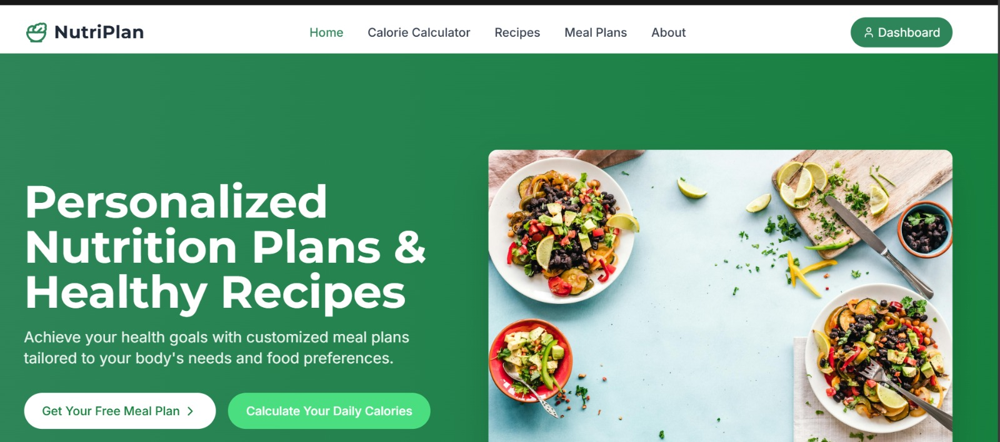

# **Nutrition Website**

  
  
  


---

## 📋 **Project Description**
The Nutrition Website is a modern web application designed to empower users to track their dietary intake, explore nutritional data, and receive personalized diet recommendations. Built with a scalable and user-friendly architecture, it integrates a food database and provides insightful visualizations to promote healthier eating habits.

---

## 🖼️ **Banner**


---

## 🌟 **Features**
- 🍎 **Meal Tracking**: Log daily meals and view detailed nutritional breakdowns (calories, macros, vitamins).
- 📊 **Data Visualization**: Interactive charts to monitor nutritional trends over time.
- 🥗 **Personalized Suggestions**: Receive diet recommendations based on preferences and health goals.
- 🔒 **Secure Authentication**: User accounts with secure login for personalized tracking.
- 📱 **Responsive Design**: Seamless experience across desktop and mobile devices.
- 🍽️ **Recipe Explorer**: Discover healthy recipes tailored to dietary needs.

---

## 🛠️ **Requirements**
- Node.js 18.x+
- npm (Node Package Manager)
- MongoDB (for database, if applicable)
- Browser (for testing the frontend)
- Optional: Docker (for containerized deployment)

---

## 📦 **Installation**
### **Frontend (React Application)**

1. Clone the repository:
   ```bash
   git clone https://github.com/mohameddsalmann/nutrition_website.git
   cd nutrition_website/frontend
   ```

2. Install dependencies:
   ```bash
   npm install
   ```

3. Run the development server:
   ```bash
   npm start
   ```

4. Alternatively, build and run with Docker:
   ```bash
   docker build -t nutrition-frontend .
   docker run -p 3000:3000 nutrition-frontend
   ```

---

### **Backend (Node.js/Express Server)**

1. Navigate to the backend directory:
   ```bash
   cd nutrition_website/backend
   ```

2. Install dependencies:
   ```bash
   npm install
   ```

3. Set up environment variables:
   Create a `.env` file in the `backend` directory with:
   ```
   PORT=5000
   MONGODB_URI=your_mongodb_connection_string
   API_KEY=your_nutrition_api_key
   ```

4. Run the server:
   ```bash
   node server.js
   ```

5. Alternatively, build and run with Docker:
   ```bash
   docker build -t nutrition-backend .
   docker run -p 5000:5000 nutrition-backend
   ```

---

## 📑 **Documentation**
For detailed API documentation, access the backend's API endpoints:
- Backend API: `http://localhost:5000/api/docs` (if Swagger/OpenAPI is implemented)
- Frontend: Open `http://localhost:3000` in your browser to explore the application.

For additional setup or configuration details, refer to the [docs](./docs) folder.

---

## 🤝 **Contributing**
We welcome contributions to enhance the Nutrition Website! To contribute:
1. Fork the repository.
2. Create a feature branch (`git checkout -b feature/your-feature`).
3. Commit your changes (`git commit -m "Add your feature"`).
4. Push to the branch (`git push origin feature/your-feature`).
5. Open a Pull Request with a clear description.

---

## 📜 **License**
This project is licensed under the MIT License. See the [LICENSE](LICENSE) file for details.

---

## 📬 **Contact**
For questions or feedback, reach out to:
- GitHub: [mohameddsalmann](https://github.com/mohameddsalmann)
- Email: [Your email, if available]

Thank you for exploring the Nutrition Website! 🌿 Let's make healthy eating simple and fun!
